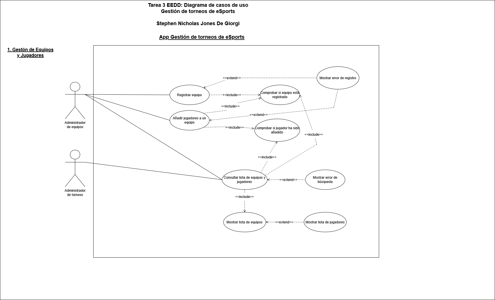

# torneo-esports-uml
Este repositorio es para realizar la tarea 3 de EEDD UNIR

**IMPORTANTE** Iré actualizando este **README** según vaya trabajando en la tarea, de momento está montado con
la estructura solicitada.

# Sistema de Gestión de Torneos de eSports

## Autor
Stephen Nicholas Jones De Giorgi
Perfil de GitHub: https://github.com/L0cksat

## Descripción del Proyecto

Se puede acceder al repositorio del proyecto a través del siguiente enlace: https://github.com/L0cksat/torneo-esports-uml

Este proyecto se enfoca en realizar e implementar un sistema de gestión de torneos de eSports utilizando UML para el modelado y Java para la implementación.

## Diagramas UML
### Diagrama de Casos de Uso

### Diagrama de Clases

## Estructura del Proyecto
torneo-esports-uml/  
| ├── diagrams/  
|   ├── casos-uso.png  
|   ├── clases.png  
├── README.md  
├── .gitignore

## Instalación y Ejecución
1. Clonar el repositorio:
`git clone https://github.com/L0cksat/torneo-esports-uml`

2. Compliar y ejecutar el proyecto:
   Al final no me ha dado tiempo realizar el código en Java, por lo tanto no hay compliación ni ejecución.

## Justificación del diseño
(Tengo que poner aquí todas la justificaciones de la estructura y el cómo y por qué de la organización de las clases.)

**1. Análisis del problema y requisitos del sistema:**
 
    <ul>
    <li>**¿Quiénes son los actores que interactúan con el sistema?**
     
        _En mi opinion, los actores en este caso serían un Administrador de equipos (sería el jefe de equipo o entrenador) y el Administrador de torneos (que sería el administrador de la organización quienes organizan los torneos). De momento para justificar la presencia del actor Administrador de torneos en el punto 1 del diagrama de caso de uso, es porque luego se va a interactuar con más partes del sistema en el caso de "Crear torneo", "Inscribir equipo en un torneo" y "Generar emparejamiento de partidas" del punto 2 de Gestión de torneos. Mi justifcación del actor de Administrador de equipos es porque yo veo y entiendo que el entrenador tiene la información del equipo y de sus jugadores y para facilitar la gestion de registro, el actor de Administrador de equipos puede directamente interactuar con el sistema para registrar su equipo y sus jugadores, que en mi opinion reduce el factor del error del registro (que no quiere decir que no habrá errores)._</li>
    <li>**¿Cuáles son las acciones que cada actor puede realizar?**
     
        _Como he explicado en la pregunta anterior en este caso el actor de Administrador de equipos se encargaría de registar la información de su equipo y por lo tanto los jugadores que forman parte de ese equipo, por lo cuál realizaría en el punto 1 del diagrama de casos de usos las acciones de "Registrar equipo" y "Añadir jugadores a un equipo" además, en mi opinion, puede interactuar con el sistema para consultar la lista de equipos y jugadores tanto como el suyo como para ver los equipos rivales, por lo tanto puede realizar la acción de "Consultar lista de equipos y jugadores".
        En el caso del actor Administrador de torneos, como he comentado antes, ahora mismo en el punto 1 del diagrama de casos de usos solamente le interesaría consultar la lista de equipos y jugadores para luego posteriormente asñadirlos al torneo correspondiente, por lo tanto puede interactuar con el sistema para realizar la acción de "Consultar lista de equipos y jugadores"._</li>
    <li>**¿Cómo se relacionan entre sí las entidades del sistema?**
     
        _En este caso las entidades se relacionaría entre sí con relaciones mayormente de dependencia ya que por ejemplo la acción de "Añadir jugadores a un equipo" depende de que si; primero el equipo exista en el sistema (el sistema lo tendrá que comprobar a través de la acción "Comprobar si equipo está registrado") y luego posteriormente tiene que hacer la comprobación de si el jugador haya sido añadido anteriormente a través de la acción de "Comprobar si jugador ha sido añadido", la acción principal de "Añadir jugadores a un equipo **depende** de estas dos comprobaciones para poder ejecutarse._</li>
    </ul>

**2. Identificación de los casos de uso y elaboración del diagrama:** 
 
El diagrama de los casos de uso se encuentran en la carpeta "diagrams"

2.1 Justificación del **punto 1** "Gestión de equipos y jugadores", diagrama de casos de uso.
   <ul>
    <li>Registrar equipo</li>
    <li>Añadir jugadores a un equipo</li>
    <li>Consultar lista de equipos y jugadores</li>
   </ul>
Todo lo escrito aquí en esta justificación se hace referencia al punto 1 del diagrama de casos de usos.
En primer lugar he añadido dos actores: El administrador de equipos (quien sería el jefe o entrendador del equipo) quién interactuaría con el sistema para poder registar su equipo dentro del sistema y el administrador de torneos (de la organización quienes organizan los torneos donde participarán dichos equipos).

En el caso de uso **"Registar equipo"** (que desempeña el actor Adiministrador de equipos), el sistema tendría que hacer una comprobación para ver si el equipo que se está registrando ya existe en este caso sería **"Registrar equipo"** que include/incluye a **"Comprobar si equipo está registrado"**, por lo tanto la acción de **"Registrar equipo"** depende de la comprobación de **"Comprobar si equipo está registrado"**. También he añadido el caso de uso **"Mostrar error de equipo ya existente"** que se ejecutará con el caso de uso base de **"Registrar equipo"**, cuando se cumpla la condición que durante la comprobación previa detecta el equipo existente en el sistema.

En el caso de uso **"Añadir jugadores a un equipo"** (que también desempeña el actor Administrador de equipos), el sistema primero tendría que hacer una comprobación para ver si el equipo existe y luego una segunda comprobación para ver si el jugador haya sido añadido anteriormente o no, por lo tanto la acción principal **depende** de estas dos comprobaciones para poder ejectuarse correctamente. He añadido también el caso de uso **"Mostrar error de jugador ya existente"** que se ejectuará con el caso de uso base de **"Añadir jugadores a un equipo"**, con la condición que al realizar la comprobación previa, detecta que ya existe ese jugador.

En el caso de uso **"Consultar lista de equipos y jugadores"** que pueden desempeñar los dos actores mencionados anteriormente para hacer comprobaciones de si han registrado correctamente tanto los equipos como los jugadores que forman parte de dichos equipos. El sistema tiene que comprobar si el equipo existe y luego si los jugadores de dicho equipo existen a través de los casos de uso de **"Comprobar si equipo existe"** y **"Comprobar si jugador ha sido añadido"** una vez realizado estas acciones, en mi opinion, el sistema le puede mostrar tanto al Administrador de equipos como el Administrador de torneos (y según que información desea que se le muestre el sistema) tanto una lista de equipos (a través del caso de uso **"Mostrar lista de equipos"** que está include/incluido en **"Consultar lista de equipos y jugadores"**), y de ese caso de uso se muestra la lista de jugadores de dichos equipos (a través del caso de uso **"Mostrar lista de equipos"** que extend/extiende de **"Mostrar lista de equipos"**). También he añadido el caso de uso **"Mostrar error de búsqueda"** para que muestre en pantalla a los actores que no se ha podido encontrar los datos que buscaban, que el escenario más probable es porque se ha equivocado a la hora de escribir el/los datos.
 
2.2 Justifcación del **punto 1** "Gestión de equipos y jugadores" diagrama de clases.
He planteado crear 4 clases para poder realizar la gestión de los equipos y jugadores que los desglosaré abajo:
<ul>
    <li>Equipo</li>
    <li>Jugador</li>
    <li>SistemaRegistroTorneo</li>
    <li>VistaSistemaRegistroTorneo</li>
</ul>

**Entidades/Clases:**
<ol>
    <li>**Equipo:** 
    Para esta clase es lo que sería la entidad de equipo que sería de tipo modelo, aquí tendríamos los atributos que tiene dicha clase para poder indentificarla en este caso serían datos básicos como
    **idEquipo**, **nombreEquipo**, **lugarOrigenEquipo**, **numeroMiembros** y tendría un método para poder añadir los jugadores a dicho equipo.</li>
    <li>**Jugador:** 
    Aquí tendríamos lo mismo como con Equipo que también sería tipo modelo, tendríamos los atributos básicos que para poder identificar la clase, que en este caso serían: **idJugador**, **nombreJugador**, **lugarOrigenJug** y 
    tendría el método para mostrar los detalles del jugador en cuestión que sería mostrarDetalles()</li>
    <li>**SistemaRegistroTorneo:** 
    Aquí tendíamos la clase controlador del sistema donde albergan los demás métodos además de dos atributos que luego compartirá con la siguiente clase: VistaSistemaRegistroTorneo. Estos atributos serían los siguentes:
    **List--Equipo--** y List--Jugador--. Aquí tendríamos los métodos CRUD de crear equipos y jugadores, modificar equipos y jugadores, eliminar equipos y jugadores, además de más métodos privados como  verificar si
    los equipos y los jugadores ya existen en el sistema ya que es una función interno del sistema y no necesita ser vista por otra clase. En el caso de los métodos de **consultarListaEquipos()** y **consultarListaJugadores()** 
    estos métodos son publicos para que la clase de VistaSistemaRegistroTorneo pueda verlos para poder ejectuar el registro por parte del usuario con los métodos de **procesarRegistroEquipos** y **procesarRegistroJugadores**.</li>
    <li>**VistaSistemaRegistroTorneo:** 
    Con está clase, mi planetamiento es hacer una clase de vista, que muestra los datos al usuario cuando consulta sobre las listas de los equipos y los jugadores, igual como ser el interfaz por donde lo cual el usuario pueda ejectuar el proceso de registrar el equipo y sus jugadores, que se puede hacer a través de los métodos **mostrarEquipos**, **mostrarJugadores** de consulta y con los métodos **procesarRegistroEquipos** y **procesarRegistrosJugadores** para realizar los registros.</li>
</ol>
 

**Relaciones entre clases:**
<ol>
<li>Relación entre **Equipo** y **Jugador**: Aquí sería una relación de agregación ya que mi planteamiento es que pueden existir jugadores que no pertencen a ningún equipo o que estén sin equipo (el ejemplo que tengo en mente es si un jugador es expulsado de un equipo por mala conducta, o no puede participar por lesión, enfermedad, etc. Sigue siendo un jugador, pero estaría sin equipo) y así creo que justifico la relación de agregación.</li>
<li>Relación entre **Equipo** y **SistemaRegistroTorneo** y **Jugador** y **SistemaRegistroTorneo**: En este caso serían dos relaciones de asociación unidirecional, en estos casos sería **SistemaRegistroTorneo** quién conoce a ambas clase de **Equipo** y **Jugador** y recibe los datos de ambas clases para poder luego realizar las gestiones pertinentes. En este caso las clases de **Equipo** y **Jugador** no tienen porque conocer al **SistemaRegistroTorneo**. </li>
<li>Relación entre **VistaSistemaRegistroTorneo** y **SistemaRegistroTorneo**: Ésta relación es de asociación unidireccional también ya que es más común que el VistaSistemaRegistroTorneo mantenga una referencia persistente con la clase controlador SistemaRegistroTorneo para luego mostrar los datos de la consulta y procesar los registros.</li>
</ol>

## Conclusiones
Me ha gustado la tarea porque me ha dado la posibilidad de poder practicar este tipos de diagramas. Noto que hay muchas posiblidades y eso (siendo la persona que soy) me ha causado un poco de incertidumbre, pero me gusta la manera que se puede idear los conceptos de un sistema o aplicación con un lenguaje universal y luego convertirlo en código.
Lamentable en mi caso no he podido traducirlo en Java, igual como no seguir con los demás puntos de la tarea (ya que se ha establecido tanto en clase como en el PDF de la tarea que son opcionales), pero me hubiera gustado realizarlos también. Lo más probable es que lo usaré para practicar antes de los examenes finales y así mantener fresco los conocimientos, porque necesito practicar más este lenguaje de diagramas más y así intentar dominarlo lo mejor que pueda. Lo veo muy útil desde una perspectiva ya que se puede diseñar la aplicación en su totalidad, pero como has comentado en tu última clase, ahora todos miran por conseguir un MPV (minimo producto viable) para poder sacarlo antes al mercado y así evitar que otros puedan capitalizar sobre tu idea, y después seguir ampliando el diseño a través de UML para poder aun así refinar más la aplicación.